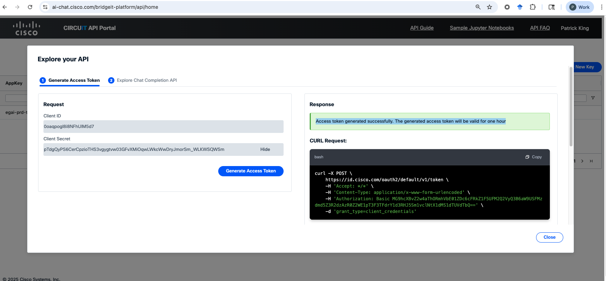

# ReXML
RElnotes to MW (probably should call it ReMW but I already started the project when I envisioned DITA not MW...)

Translate Release note output from Jira to MediaWiki markup/tables, at least...

Usage:

1. Have Python v3 and Pip. If you don't yet, get it from [python.org](https://www.python.org/downloads/) then proceed to the next step.

1. From Terminal, validate your Python and Pip configuration:

```bash
% python --version
Python 3.12.0
% pip --version
pip 25.0 from /Library/Frameworks/Python.framework/Versions/3.12/lib/python3.12/site-packages/pip (python 3.12)
% 
```

Any versions should work. Once you've validated your set up by successfully checking versions, proceed to the next step.

3. Download this repo. Lots of ways to do this, including **Code > Download Zip** then extract.

4. From Terminal, install [pandas](https://pypi.org/project/pandas/) and [openai](https://pypi.org/project/openai/) and [requests](https://pypi.org/project/requests/) by entering:

```bash
% pip install pandas
% pip install openai
% pip install requests
```

You only must do this once; if you want to check whether you already have them, you could enter `pip show pandas` etc. first.

(All the *other* dependencies, from `__future__` on down...come with Python 3 so if you have Python3 you are set)

5. Translate a specific jira file (named Jira.csv) file from your downloaded, extracted ReXML directory. In Terminal, from the directory containing prompt.py, enter:

```bash
% python3 prompt.py <Jira.csv>
```
To call openai and output its response as response.mw.

6. Because I'm burning thru tokens like kindling, you can also translate a specific jira file (named Jira.csv) file from the ReXML directory via an offline translator, no openai prompt/call. In Terminal, from the ReXML directory containing both prompt.py and Jira.csv, enter:

```bash
% python3 noprompt.py <Jira.csv>
```
To munge the csv to mw locally, no REST API, no tokens. Whether its any good or not is a good question. It outputs output.mw.

7. With our very recent circuit provisioning, I now have a functional Circuit API version: promptcircuit.py. 

```bash
% python3 promptcircuit.py <Jira.csv>
```

This is based on our project's details. Which means I get an appkey and secret [here.](https://ai-chat.cisco.com/bridgeit-platform/api/view). Then I copy the key, export it to a local env variable (`CISCO_API_KEY`), and promptcircuit.py runs and outputs `circuitresponse.mv`. 

Now, we can at least compare circuit to openai and local translation, and afaik we can avoid the "running out of openai tokens/thoughput" errors, though I haven't yet revised promptcircuit to do a full blown csv to mw request (which overwhelmed my free openai horsepower so I cut it back to 10 rows).

One thing to figure out: the circuit API provision seems to give access tokens good for **one hour**. So...that implies that I/we will have to get one, put it into the env var for an hour, run promptcircuit, then get another...repeat.

Likely there are other ways to do it with key persistence; I don't know yet. Or maybe that's just the circuit way?


